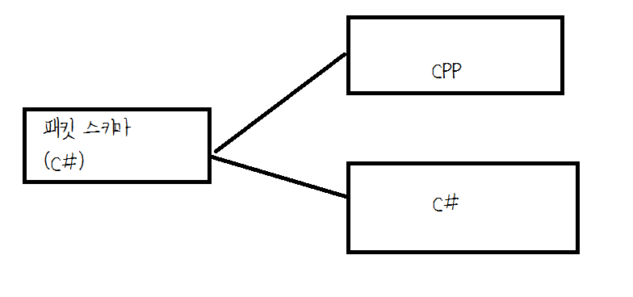

Merona.Pgen.cs
====
pgen packet generator for Merona.cs

<br>

```c#
public class MyGamePackets
{
  public class Login
  {
    [S2C]
    public string id;
    public string password;
    
    [C2S]
    public bool result;
  }
}
```

```c#
namespace MyGamePackets
{
  public class Login
  {
    public class Request
    {
      public string id;
      public string password;
    }
    public class Response
    {
      public bool result;
    }
  }
}
```

```cpp
namespace MyGamePackets
{
  struct LoginRequest
  {
    std::string id;
    std::string password;
  }
  struct LoginResponse
  {
    bool result;
  }
}
```
